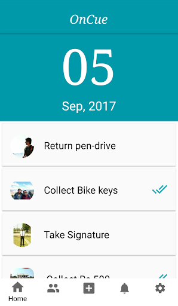
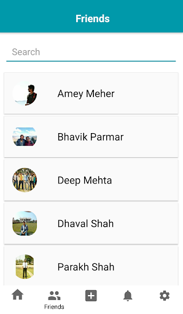
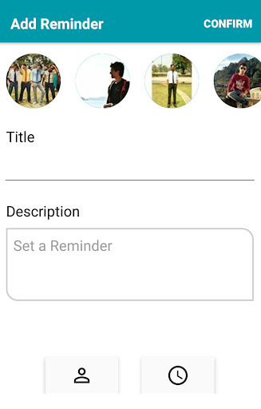
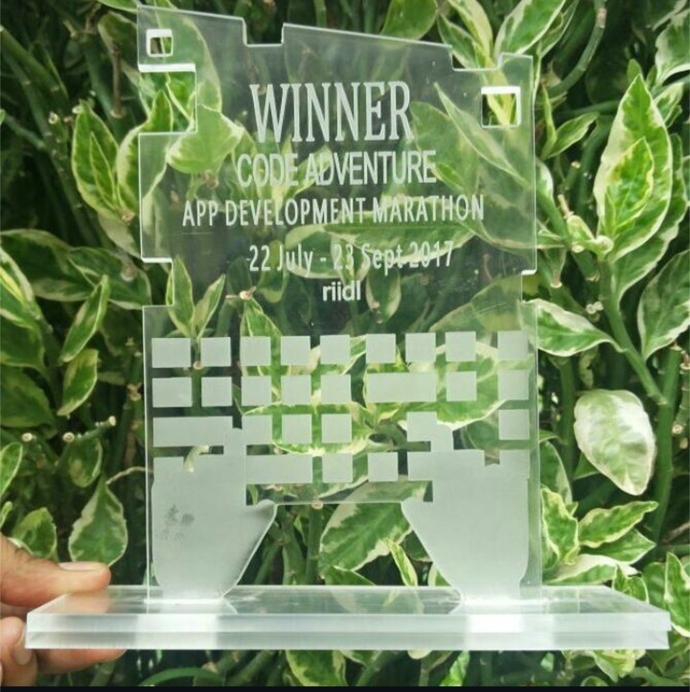
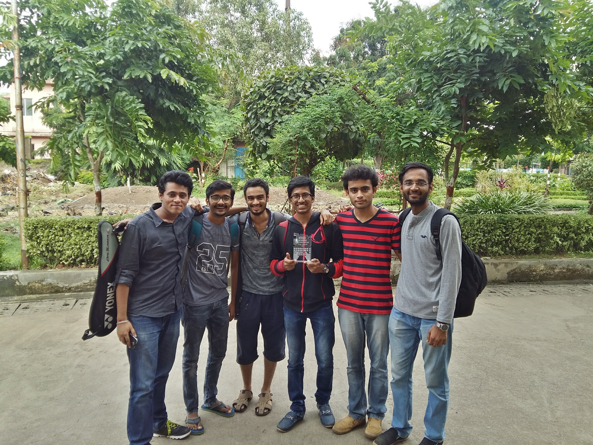
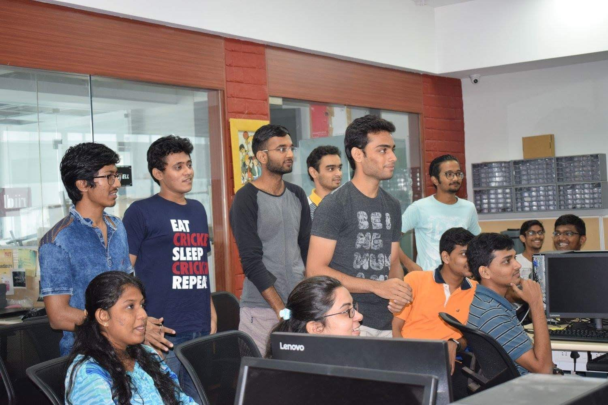

# Oncue

## The Proximity-Based Reminder App

**Aim:** Develop an Android app that acts as a reminder system with a unique feature to remind users not only based on time but also based on people around them.

## How It Works

The app uses proximity detection to provide reminders. For example:

- Amey sets a reminder to ask Deep for his application.
- When Deep comes within Bluetooth range of Amey, a notification pops up on Amey's phone, reminding him to ask Deep for the application.

This app is particularly useful for people working in offices, helping them manage their tasks and interactions more effectively.

## Screenshots

  
  
  

 

  

 

  
  

 

  

## Tools and Technologies

- **Developing the Application:** Android (Java + XML)
- **Database:** MySql
- **Storage:** FTP, Local Storage
- **Authentication:** Facebook Auth (Mobile Login, Facebook Login)

## Features

- **Proximity-Based Reminders:** Notifications based on nearby people.
- **Customizable Reminders:** Set reminders for specific people.
- **Bluetooth Integration:** Detect nearby devices to trigger reminders.

## Hackathon photos
 

 
 

 

 

## Contributing
If you would like to contribute to this project, please fork the repository and submit a pull request with your changes.